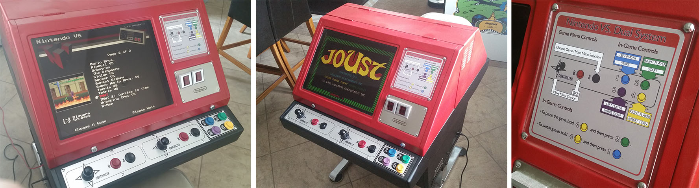

Frontend for Nintendo Vs.
=============================

This is a frontend for the Nintendo VS. DualSystem (aka "[Red Tent](http://www.johnsarcade.com/nintendo_vs_dualsystem_tent.php)") arcade machine.

It is designed to support up to four players on two screens running up to two concurrent MAME instances on a single Windows-based PC.

Each side can play its own game independently (two players on each side) or both sides can play a four player game (e.g. Gauntlet, TMNT).

This repository contains all of the software and docs you'll need to assemble a replica of my cabinet.

You can read more about the cabinet [here](http://justin-credible.net/2016/10/21/nintendo-vs/)  or see a video of the frontend in action [here](https://www.youtube.com/watch?v=q1Z3KqxMIOY).

Pre-built releases can be found on the [releases page](https://github.com/Justin-Credible/nintendo-vs-frontend/releases), and changes are documented in the [change log](CHANGELOG.md).



# Overview

To enable two games to be playable simultaneously on a single PC with two screens, I had to write a custom frontend for my cabinet.

The frontend displays a game list on each screen and allows users to select a game. It shows video clips for the selected game. Each side of the cabinet operates independently, unless a four player game is selected, in which case both sides can play the same game together.

The frontend is a multi-window [Electron](https://github.com/electron/electron) app built to run on Windows 8.1. For full operation, it relies upon a custom built version of [MAME](https://github.com/mamedev/mame), a Win32 input daemon hook, [Borderless Gaming](https://github.com/Codeusa/Borderless-Gaming), and [DisplayFusion](https://www.displayfusion.com/).

This repository contains the frontend, input daemon, custom patches for MAME, as well as documentation for the project.

Frontend development was done primarily on a Mac using [Visual Studio Code](https://code.visualstudio.com). The input daemon was built on Windows 10 using Visual Studio 2015.

Testing was done on Virtual Box using a Windows 10 installation configured for dual displays. The final cabinet runs Windows 8.1.

# Compiling

If you wish to build the Frontend and Input Daemon packages you can follow the steps below. Otherwise see the [releases](https://github.com/Justin-Credible/nintendo-vs-frontend/releases) section for a pre-packaged zip file.

## Frontend

The frontend is writen in [TypeScript](https://www.typescriptlang.org/) and runs in [Electron](https://github.com/electron/electron). Build tools require Node v16.13.2. Packaging requires Node v11.15.0.

```
$ git clone https://github.com/Justin-Credible/nintendo-vs-frontend.git
$ cd nintendo-vs-frontend
$ nvm install v16.13.2
$ nvm use v16.13.2
$ ./bin/setup
$ ./bin/build
$ ./bin/run
```

You can use `./bin/package` to create a distribution build in the `build` directory. The frontend can be built/packaged on a Mac or Windows. If you package on a Mac you may be prompted to install certain Wine components (the packager needs a Windows specific API to inject an icon into the Win32 binary; see [here]()https://github.com/electron-userland/electron-packager#building-windows-apps-from-non-windows-platforms). If you are not prompted to install it, you can install Wine manually using Homebrew: `brew install wine`.

```
$ nvm use v11.15.0
$ ./bin/package
```

The frontend is split into two code-bases; the visual part is located in `src/renderer` and the launcher that handles window management etc is located in `src/shell`. Both of these make up the frontend.

## Input Daemon

The input daemon is written in C# and relies on Win32 API hooks. It is responsible for hooking key events and sending them to the frontend shell. This allows the menu to receive controller input even the window is not in focus (for example, when the window is focused on the MAME instance that is running on the other side).

The input daemon is located in `src/input-daemon`. Open the solution file and build. The resulting `Input-Daemon.exe` binary should be placed into the `app` directory before packaging the frontend.

This repository contains a pre-built input daemon binary so I didn't forget to include it in the build package because I primarily developed on a Mac.

## MAME

This project needed a custom build of [MAME](https://github.com/mamedev/mame); I used version 0.178 (which has the required `-global_inputs` switch).

In addition, you'll need to apply the patches located in `assets/mame-patches`.

The first patch `hi_178.diff` adds back in high score tracking, but more importantly, disables any "nag" or loading screens on boot up.

The second patch `mame-single-channel-audio.patch` was written by myself for a specific feature; the ability for MAME to play sound from only the left or right channel. My cabinet has two speakers; one on each side of the cabinet. Therefore the frontend needs to tell MAME to use the left or right channel only depending on which side launched a game. This patch adds two command line switches which the frontend uses when launching MAME: `-audio_left_channel_only` and `-audio_right_channel_only`.

# Configuration

`config.yml` allows for configuration of key bindings, auxiliary application paths, and MAME configuration.

`game-list.yml` contains the list of games to display on the menu. It also allows for specifying metadata about each game (e.g. is it a single/dual screen, player count, ROM name, controller layout).

# Other Requirements

The frontend expects exactly two displays connected. Windows should be set to "extended" display mode so that each screen has its own desktop. The UI was built to display at 1280x1024. If your screens are running at different resolutions, you'll need to adjust the `scalingFactor` configuration parameter for each screen in order for the UI to fit on the screen. See `config.yml` for more details.

If you are using a non-Windows platform for development (or set `debug: true` in `config.yml`), a seperate renderer window will open when you run the frontend. This window is used to emulate the input daemon which is only available for Windows. This window must be in focus when pressing keys so that the frontend can receive keyboard input.

[Borderless Gaming](https://github.com/Codeusa/Borderless-Gaming) must be installed (tested with version 8.4.33315.1328). Each game must be launched at least once from each side of the cabinet and added to the favorite list so MAME window will be forced to full screen during launch. A pre-built list is located in `assets/borderless-gaming`.

While two MAME instances can run currently (one for each side), PC games are limited to a single instance. When launching a PC game the displays will switch to "clone" mode to display the same image on each screen. They'll switch back to "extended" mode once the game exits.

[DisplayFusion](https://www.displayfusion.com/) Pro must be installed (tested with version 8.0). It is used when launching PC games; it switches between the "extended" and "clone" display modes.

# Attract Mode

When one side is left idle for a while, an attract mode will start. It cycles though several animations to attract attention.

The attract mode screens were built using various HTML and CSS demos I found on CodePen. Links to the author's original works are found in comments in each of the HTML files at `src/renderer/Views/Attract-Mode`.

A pre-rendered version of the attract screen is located at `app/www/video/attract-mode.mp4`. By using `config.yml`, you can switch between the real-time and pre-rendered modes.

# Misc

I used two [Mini-Pac](https://www.ultimarc.com/minipac.html) keyboard encoders. Any keyboard encoder with a shift function should work. I included my binding documentation in `assets/controls`. This directory also contains the Mini-Pac layout and configuration files which can be flashed to the Mini-Pac (these are for the pre-2015 model of the board).

I've also included all of my MAME configs for these control mappings in `assets/mame-configs`.

The `assets/mame-nvram` directory contains additional settings for each game (such as silenced attract modes, when possible).

The `assets/marquee` directory contains the Photoshop file I used to create the instruction cards. I printed on high gloss card stock at my local office supplies store.

## Launch as primary shell

The frontend can be set as the startup shell which will replace Windows Explorer by adding a entry called `Shell` at the following registry location. It should point to the full path of `nintendo-vs-frontend.exe`:

`HKEY_CURRENT_USER\Software\Microsoft\Windows\CurrentVersion\Policies\System`

I recommended you do this for a dedicated arcade user and leave your primary account for system administration. Since Windows Explorer will no longer load when the arcade user logs in. You can press CTRL+Shift+Esc to open the task manager, or CTRL+ALT+Delete to log off.

Finally, you can enable auto login for your arcade user via Start > Run > `control userpasswords2`.

# Contributing

I'm not interested in making this a general purpose frontend and therefore will not accept any contributions of that nature. This frontend is specifically for my dual screen cabinet.

If you are looking for a general purpose frontend, there are many other great ones out there: [HyperSpin](http://www.hyperspin-fe.com/), [Attract-Mode](http://attractmode.org/), and [Maximus Arcade](http://www.maximus-arcade.com/) to name a few.

